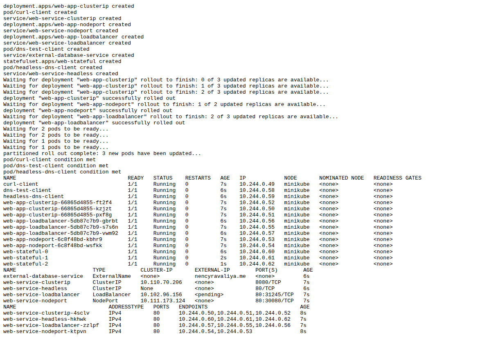
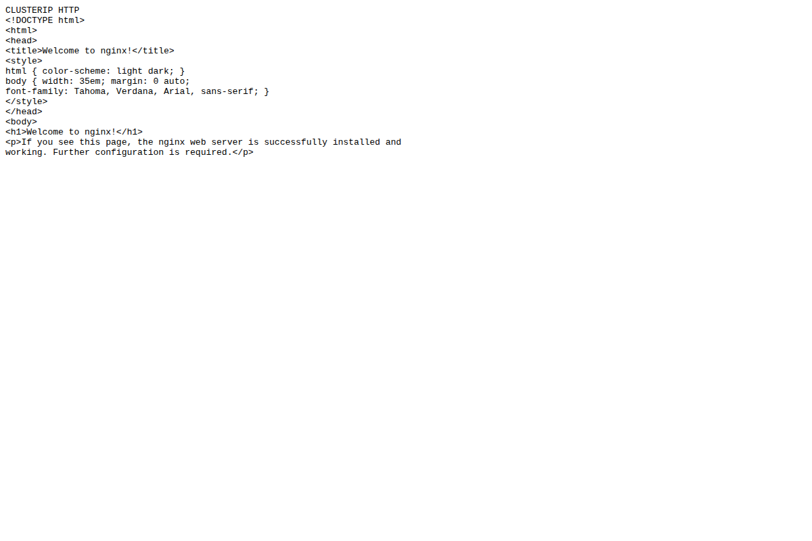
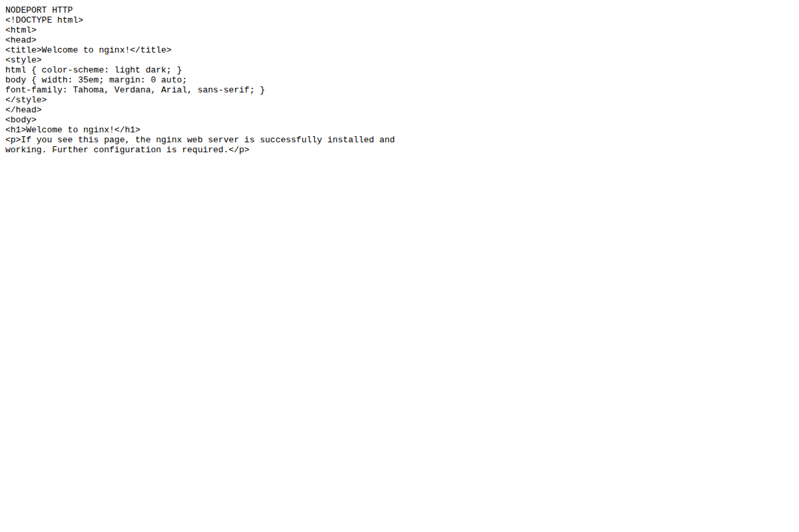
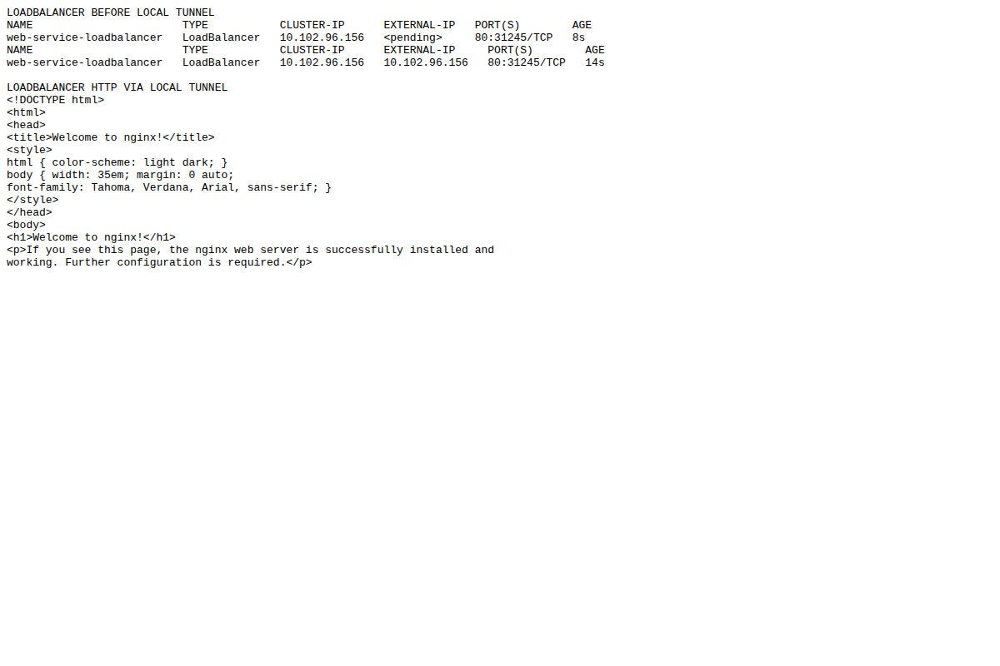
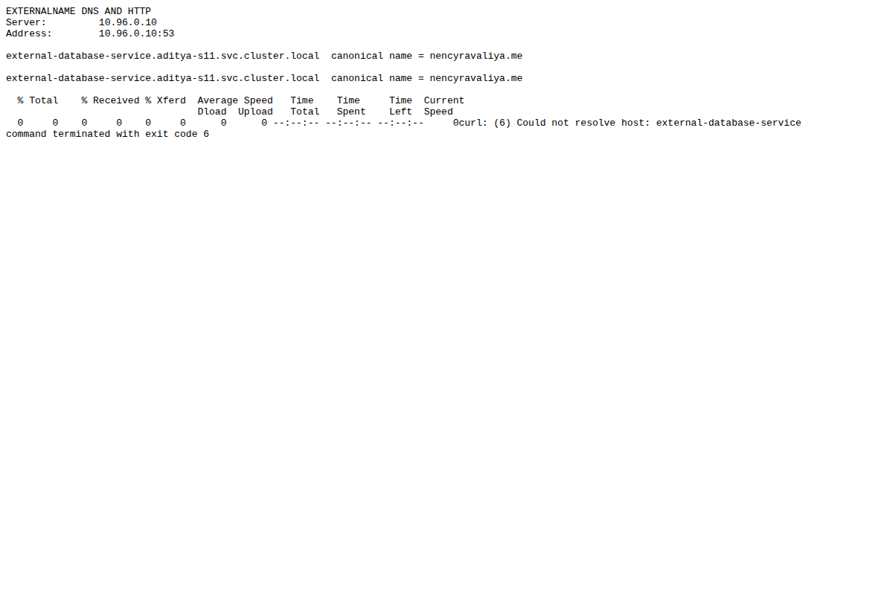
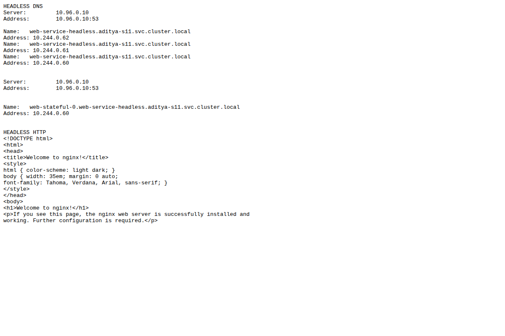
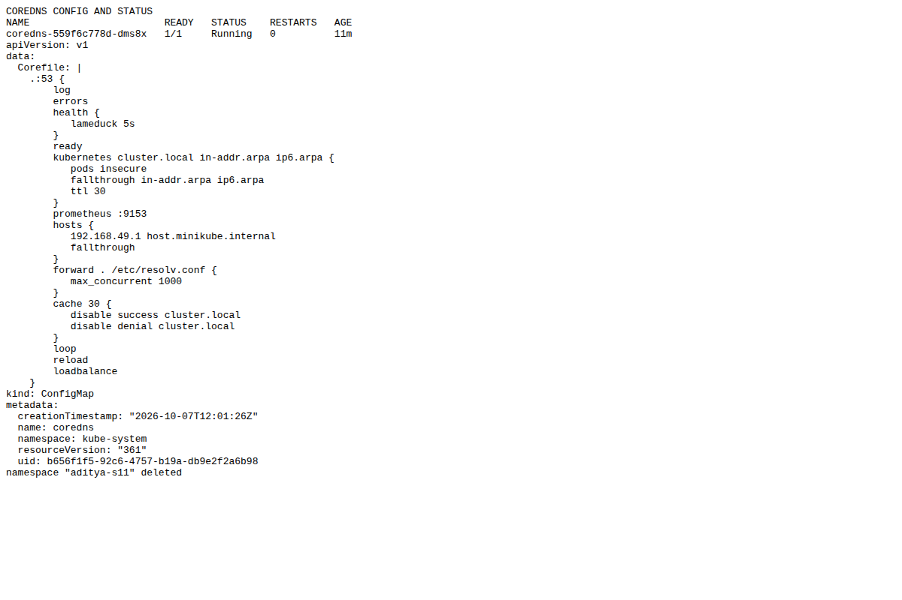

# Session 11 - Kubernetes Networking and Services

Student: Aditya Prasad  
Roll Number: 24BCS10179

## Task 1: five Service forms

Applied the teacher's YAML examples in namespace aditya-s11 on Minikube and tested each. Student YAML is included in five matching folders. [Actual output](evidence/s11-output.txt), [external-target diagnosis](evidence/s11-external-fix.txt), and scripts document the executed commands. Namespace and tunnel were removed afterward.

| Service | Actual check and result |
|---|---|
| ClusterIP | curl from curl-client to web-service-clusterip:8080 returned Nginx HTML. EndpointSlices list three Pods. |
| NodePort | curl to Minikube node IP:30080 returned Nginx HTML. |
| LoadBalancer | Initially external IP Pending. minikube tunnel assigned a local reachable IP; HTTP returned Nginx HTML. This is local simulation, not a paid cloud load balancer or publicly reachable site. |
| ExternalName | Original nencyravaliya.me alias resolved CNAME but target had NXDOMAIN. Patched the student lab to example.com: CNAME and target IP resolution passed; HTTP reached the external server and returned 403. DNS Service discovery worked, but there is no successful application-page claim. HTTP Host/TLS names may need separate configuration with ExternalName. |
| Headless | DNS returned three Pod IPs, stable web-stateful-0 FQDN resolved, and direct Pod HTTP returned Nginx HTML. |

Headless is not a separate spec.type value: it is ClusterIP with clusterIP: None. ExternalName is DNS mapping, not a proxy to selected Pods.

### Real command-output screenshots

## Task 2: object comparisons

### Deployment vs ReplicaSet

ReplicaSet maintains the requested number of matching Pods, replacing missing Pods. Scaling changes its replica count. A Deployment manages ReplicaSets and declaratively handles rollout/rollback; a new Pod template creates a new ReplicaSet and shifts replicas across old/new sets. Use Deployment for normal stateless application rollouts, not a bare ReplicaSet expecting rolling updates.

### Deployment vs DaemonSet vs StatefulSet

| Object | Pod creation and scaling | Networking/storage | Example |
|---|---|---|---|
| Deployment | Interchangeable Pods; replica count can be scaled or managed by HPA | Service selects Pods; no stable per-Pod identity. Can mount shared or external storage where suitable | Stateless API/web app |
| DaemonSet | One Pod on each eligible node; follows node addition/removal and placement rules, not a normal replica count | Node-local workload, often host access/hostPath; normal Services possible | Node log collector or networking agent |
| StatefulSet | Ordered stable Pod names by default; explicit replicas, scaling and update policies | Headless Service provides stable DNS; volumeClaimTemplates can give each Pod its own PVC retained across Pod replacement | Database members needing identity and persistent storage |

### ReplicaSet vs Service

ReplicaSet manages Pod count, not network routing. Service provides a stable virtual IP/DNS name (or another exposure form), selecting matching Pods and tracking endpoints. Client resolves Service DNS, connects to its port, and the cluster data plane forwards to a ready endpoint's targetPort. A Service can select Pods managed by any controller; its selector must match labels. Headless clients discover Pod addresses without a Service virtual-IP proxy.

## Tasks 3 and 4

See [FQDN](fqdn/README.md) and [CoreDNS](coredns/README.md).

## Sources

[Assignment](https://docs.google.com/document/d/1cjXFYf2Thm8cBEN-0C48B-v02cj3jGLd47lcO18prHE/edit?tab=t.0), teacher Session 11 examples, and official docs:
- https://kubernetes.io/docs/concepts/services-networking/service/
- https://kubernetes.io/docs/concepts/services-networking/dns-pod-service/
- https://kubernetes.io/docs/concepts/workloads/controllers/
- https://kubernetes.io/docs/tasks/administer-cluster/dns-custom-nameservers/
