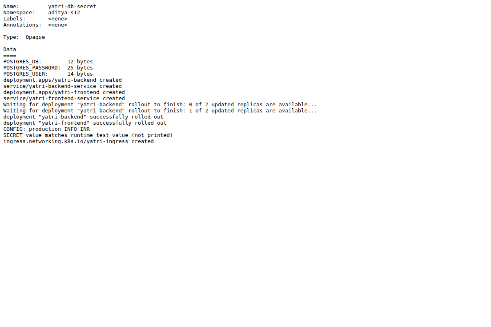
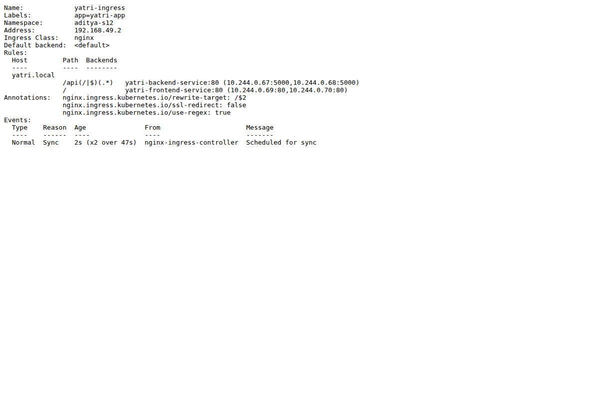
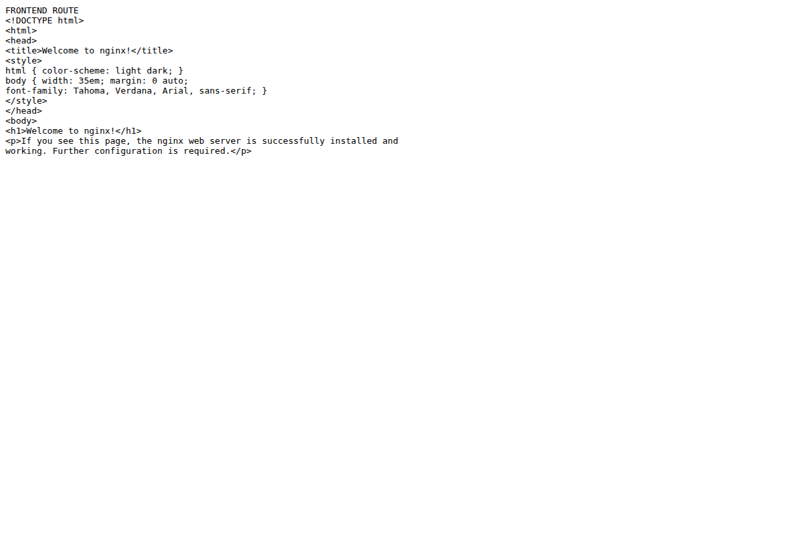
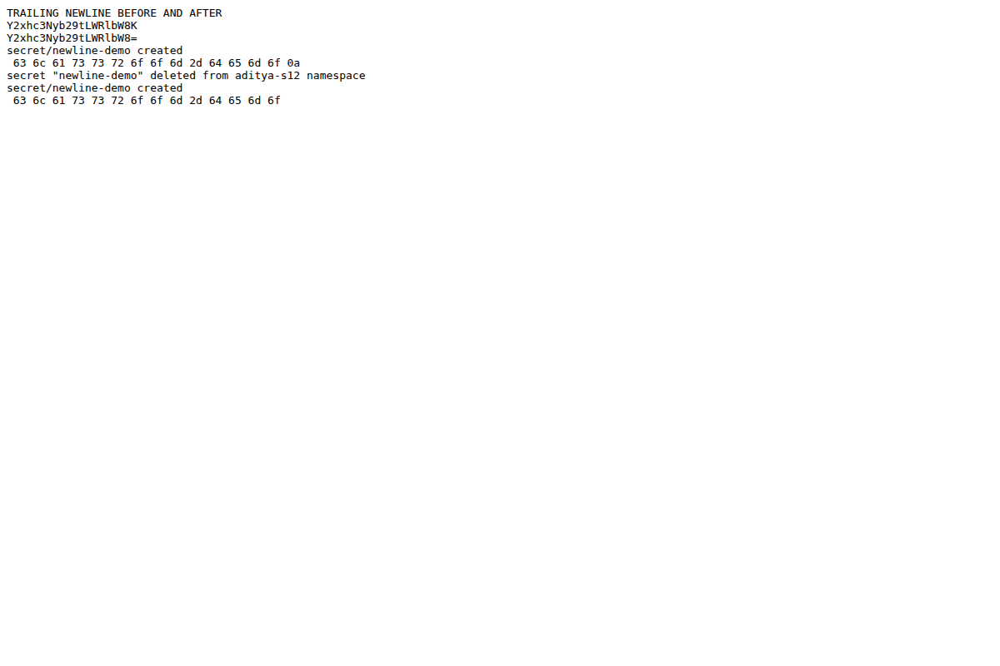
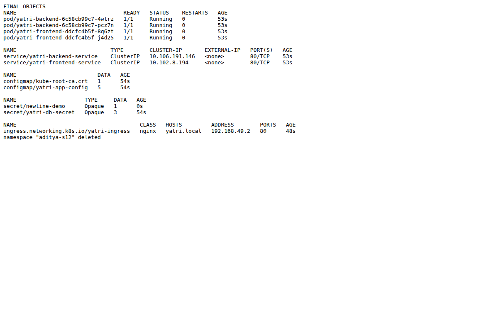

# Session 12 - ConfigMaps, Secrets and Ingress

Student: Aditya Prasad  
Roll Number: 24BCS10179

## Task 1: ConfigMap demo

Created yatri-app-config with production, INFO, INR, APP_PORT 5000 and MAX_BOOKING_DAYS 30. Injected it using envFrom into backend/frontend Deployments. Executed a backend container check and observed CONFIG: production INFO INR. ConfigMap YAML is included. This decouples non-sensitive runtime config from the image; environment-injected updates need Pod recreation to be picked up.

## Task 2: Secret demo

Created a runtime Opaque Secret, injected individual keys with secretKeyRef, inspected key lengths and verified the container value matched the disposable classroom test string without printing it. No real account credential was used. The student folder includes secret.template.yaml with placeholders, not a live Secret manifest; verify-demo.sh contains clearly named classroom-only values to reproduce the exercise.

Base64 is encoding, not encryption. A Secret committed to public Git is exposed even if its data is encoded, and removal from the current file does not remove Git history. Use private secret storage, appropriate RBAC and encryption at rest; avoid logs and Pod exec access that reveal real credentials. The teacher's original sample Secret file is preserved, not treated as a real secret.

## Task 3: Ingress hands-on

Enabled the Minikube ingress addon, waited for the controller, deployed two replicas each of frontend and backend plus ClusterIP Services. Applied ingressClassName nginx and yatri.local host rules. curl --resolve directed the test host to the local Minikube IP without editing hosts files.

- / returned the real Nginx welcome HTML.
- /api/ returned the backend API with production/INFO/INR and classroom database user/name.
- wrong.local returned 404, confirming the host rule boundary.
- describe ingress listed the backend Pod IPs and controller Sync events.

These are local checks, not a published public application URL. The included YAML is adapted from the teacher's full-demo files to isolated namespace aditya-s12.

## Task 4: Ingress vs controller

Ingress is an API resource declaring host/path routing to Services and optional TLS. A controller watches resources and configures the actual proxy/load balancer that handles requests. An Ingress alone does not implement routing; a compatible installed controller and matching class are needed. NGINX ingress addon was the actual controller used here. Other implementations include Traefik and cloud-specific controllers. Controller behavior/annotations are implementation-specific; one controller need not be a single Pod. ingressClassName can be defaulted where the cluster defines a default class, so it is not universally mandatory in every cluster.

## Task 5: trailing-newline troubleshooting

Read troubleshooting/secret-base64-gotcha.md. Reproduced the problem with disposable classroom-demo text, comparing echo and echo -n. Captured actual encoding and byte checks after storing/retrieving through a temporary Secret. The bad decoded value ended in hex 0a; the corrected value had no final 0a. The script uses an extra Base64 layer for the comparison payload stored in VALUE, so the verification decodes that payload after the Secret's own encoding. No actual PostgreSQL authentication failure was run or claimed.

Root cause: a newline is part of the original bytes before encoding. Fix: printf %s or echo -n when producing the payload, or use stringData/a secret creation mechanism that preserves the intended exact bytes. Base64 suffixes alone are not a reliable general newline test; inspect decoded bytes/length.

## Real evidence

[Full executed output](evidence/s12-output.txt) and verify-demo.sh contain the actual sequence.

## Cleanup

Deleted namespace aditya-s12 and verified NotFound plus no remaining namespaced resources. The shared Minikube ingress addon remains for later exercises.

## Sources

[Assignment](https://docs.google.com/document/d/1cjXFYf2Thm8cBEN-0C48B-v02cj3jGLd47lcO18prHE/edit?tab=t.0), teacher Session 12 full-demo and troubleshooting files, and:
- https://kubernetes.io/docs/concepts/configuration/configmap/
- https://kubernetes.io/docs/concepts/configuration/secret/
- https://kubernetes.io/docs/concepts/services-networking/ingress/
