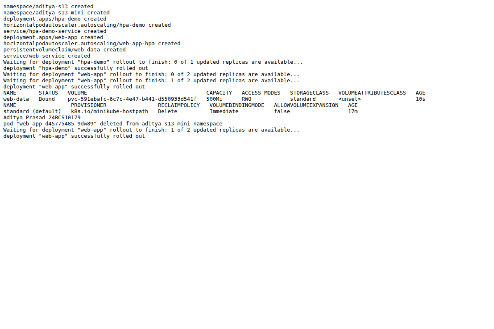
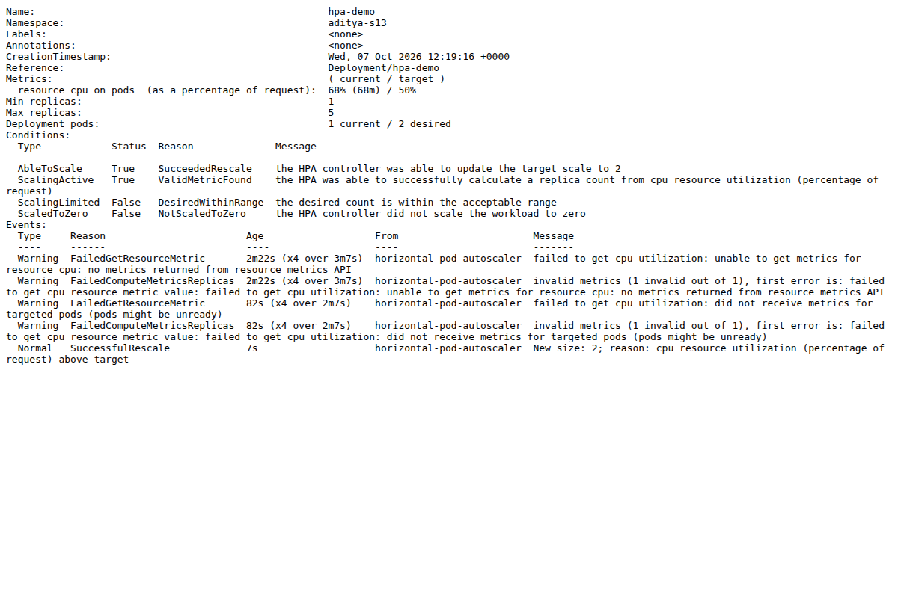
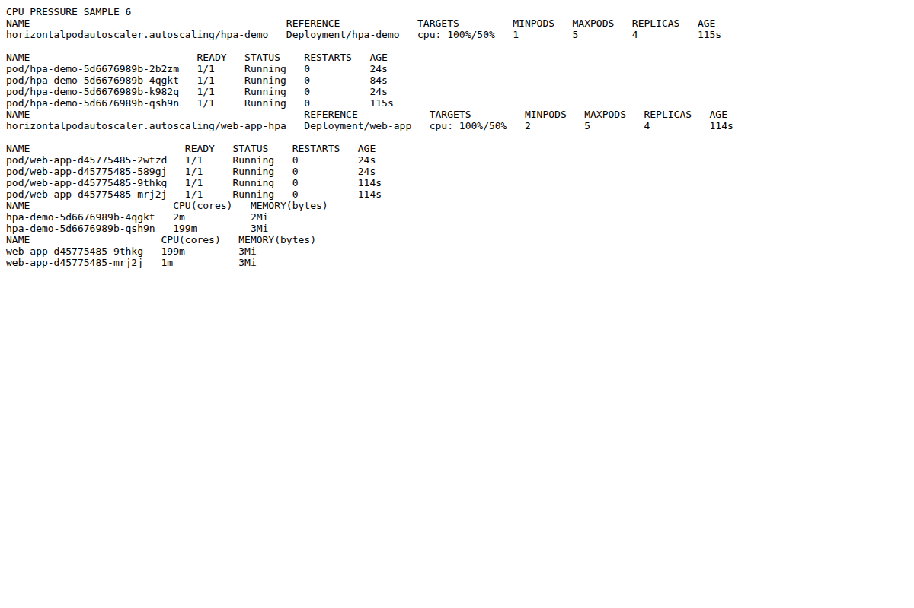
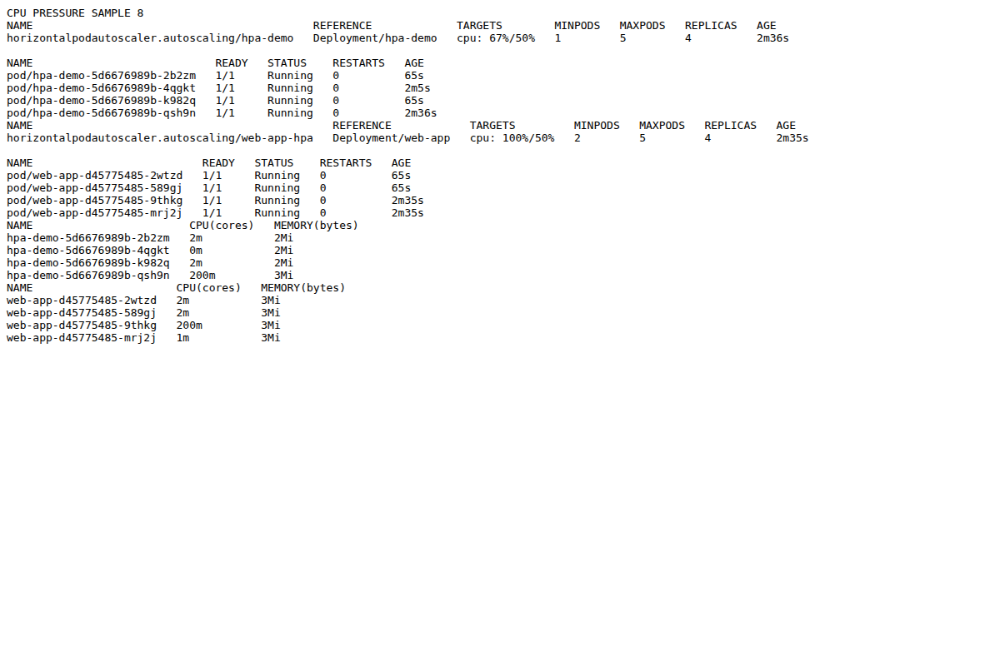

# Session 13 - Storage, HPA and Probes

Student: Aditya Prasad  
Roll Number: 24BCS10179

## Task 1: volumes

See [01-kubernetes-volumes/README.md](01-kubernetes-volumes/README.md) for emptyDir, hostPath, PV/PVC, StorageClass, dynamic provisioning and examples. Actual mini-project dynamically provisioned a 500Mi RWO PVC through Minikube standard StorageClass.

## Task 2: HPA hands-on

Used the repository's 04-hpa YAML (Deployment hpa-demo, ClusterIP Service, autoscaling/v2 HPA with 100m CPU request, 50% target, 1-5 replicas) in aditya-s13. Metrics Server was available; initial unknown values resolved after collection/readiness delay. Created an HTTP load generator, checked get hpa, get pods, top pods and describe hpa. CPU reached 51% in samples. Later describe recorded SuccessfulRescale to two replicas. The default tolerance and metrics collection windows mean one just-above-target sample alone does not prove immediate scaling.

A separate explicitly labelled in-container CPU-pressure run uses the same YAML in isolated namespaces to make the scale response clear without claiming synthetic CPU work is an HTTP traffic result. verify-cpu-pressure.sh records the exact command and samples.

## Task 3: storage/probes mini-project

Adapted the teacher mini-project YAML to aditya-s13-mini: two Nginx replicas, Recreate update strategy, PVC mounted at /data, ClusterIP Service and 2-5 replica HPA targeting 50% requested CPU. Configured startup/readiness/liveness HTTP probes; rollout reached two available Pods.

Wrote Aditya Prasad 24BCS10179 to /data/student.txt, deleted a Pod and verified the file. A separate check explicitly read it from replacement Pod web-app-d45775485-g76dm, not just the still-existing other replica. Service returned Nginx HTML from the load-generator Pod. HTTP load showed measurable CPU but did not scale the mini-project above two replicas in that run. That result is retained, not replaced with teacher expected output.

This is a single-node learning lab, not a proven production-ready multi-node design. Shared RWO storage can be mounted by multiple Pods on one node, but is not generally safe for arbitrary multi-node scaling. No real application data or external storage was used.

## Actual results and screenshots

[HTTP-load run and storage/probe output](evidence/s13-output.txt)  
[Explicit CPU-pressure run](evidence/s13-scale.txt)  
[Replacement Pod persistence check](evidence/replacement-check.txt)

CPU-pressure run reached four Ready Pods in both workloads (hpa-demo 1 to 2 to 4; mini-project 2 to 4). HPA describe recorded SuccessfulRescale. Some snapshots show old replica status just before the newly created Pods are counted, so inventory and events are interpreted together. No claim of reaching five replicas or observing full scale-down is made.

## Problems and cleanup

Nginx image does not have wget/ps; HTTP verification used the BusyBox client instead. An extra concurrent load attempt held its exec pipe open and was stopped when load-generator was deleted. Initial metrics were unknown until valid data arrived; raw metrics/API and describe checks helped distinguish collection delay from missing CPU requests. All namespaces created for these labs are deleted after evidence capture. No claim of observing full default five-minute scale-down stabilization is made.

## Sources

[Assignment](https://docs.google.com/document/d/1cjXFYf2Thm8cBEN-0C48B-v02cj3jGLd47lcO18prHE/edit?tab=t.0), teacher Session 13 04-hpa and mini-project files, and:
- https://kubernetes.io/docs/concepts/storage/volumes/
- https://kubernetes.io/docs/concepts/storage/persistent-volumes/
- https://kubernetes.io/docs/concepts/storage/storage-classes/
- https://kubernetes.io/docs/tasks/run-application/horizontal-pod-autoscale/
