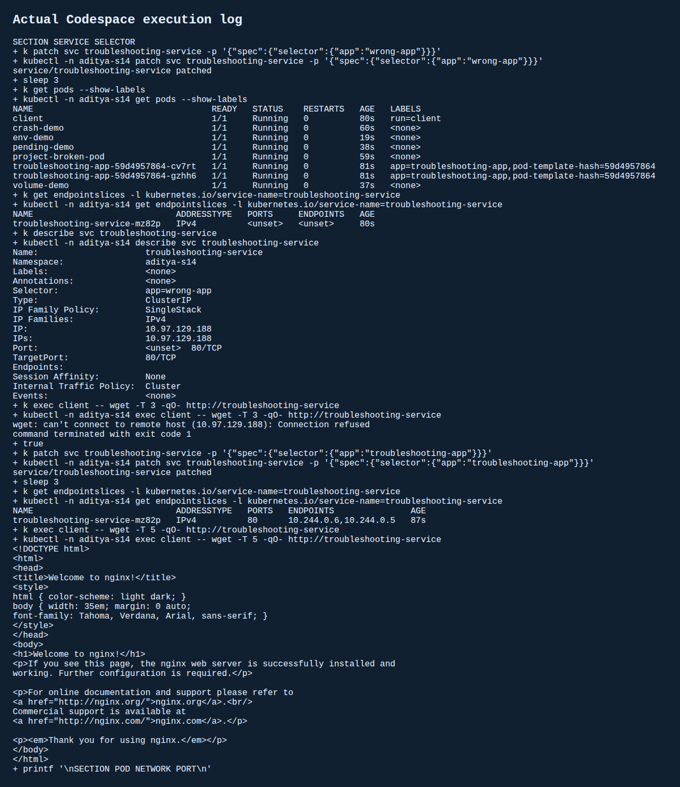

# Session 14 - Kubernetes Troubleshooting
Student: Aditya Prasad  
Roll Number: 24BCS10179

## Runtime and method
Executed in the user's 2-core GitHub Codespace with Minikube, Kubernetes v1.37.0. Each fault was observed and investigated before fixing it. Namespaces isolate the lab; teacher manifests are untouched. Terminal screenshots are rendered from the actual saved execution log, not example output.

## Commands
`kubectl get`, `get -o wide`, `describe`, `logs`, `exec`, `events`, `explain`, and `top` were executed. Initial `top` calls failed because Metrics API was not ready after the cluster resumed. Supplemental output records restart and another check; see its exact result.

## Fault, investigation, root cause, fix and verification
| Problem | Observed diagnosis | Root cause | Fix and verification |
|---|---|---|---|
| CrashLoopBackOff | Exit code 1, restart count rises, BackOff events; status snapshots show Error rather than literally CrashLoopBackOff | BusyBox script exits 1 | Replace immutable command by recreating Pod with healthy script; Ready and healthy log |
| ErrImagePull / ImagePullBackOff | Both statuses recorded, describe shows registry NotFound | `nginx:this-tag-does-not-exist` does not exist | Set image to nginx:1.27; 1/1 Running |
| Pending | FailedScheduling and selector mismatch | Node named node-that-does-not-exist selected | Recreate without selector; Ready |
| ContainerCreating | FailedMount, missing-config not found | Required ConfigMap volume absent | Create ConfigMap; Ready; read roll number from mounted file |
| Configuration | CreateContainerConfigError and missing-env not found | Missing ConfigMap referenced by env | Create it with student key; Ready; application log contains roll number |
| Service connectivity | No EndpointSlice addresses and connection refused | wrong-app selector does not match Pod labels | Restore troubleshooting-app selector; two endpoints; nginx HTTP response |
| DNS | NXDOMAIN for nonexistent-service | Wrong application Service hostname, not broken CoreDNS | Inspect resolv.conf and Service, use existing namespace-qualified name; lookup and HTTP pass |
| Pod networking | Pod IP port 81 refused, port 80 returns nginx | Client used wrong listening port | Correct port to 80; direct Pod-IP HTTP verified |

The DNS and networking cases are controlled client-side faults. They do not claim a cluster-wide DNS or CNI repair.

## Mini project
Deployed the teacher's two-replica nginx Deployment and ClusterIP Service. Investigated project-broken-pod with get/describe/events before changing its image. The missing tag is the registry error, not a credentials problem. Fixed image and verified Ready. Intentionally changed the Service selector, compared Pod labels, observed no endpoints, restored it and verified actual HTTP from a separate client Pod.

## Answers
1. get is a summary of status and age.
2. describe adds specification, conditions and events for investigation.
3. logs shows what the process printed; previous helps investigate its earlier crash.
4. exec runs checks inside a running container, such as localhost HTTP or file inspection.
5. CrashLoopBackOff is a restart delay after repeated failures, not the root cause itself.
6. ImagePullBackOff is retry delay after an image pull error; inspect the registry error.
7. Pending may mean scheduling constraints, insufficient resources or unbound storage.
8. No endpoints may mean no matching labels or no Ready backends.
9. A Service selector chooses Pods by their labels; it does not create Pods.
10. Kubernetes DNS gives Services stable names resolving to Service addresses or headless backends.

## Evidence
[Complete before/after run](evidence/s14-output.txt)  
[Supplemental crash and metrics check](evidence/s14-extra.txt)

## Sources
- https://kubernetes.io/docs/tasks/debug/debug-application/
- https://kubernetes.io/docs/tasks/debug/debug-application/debug-service/
- Teacher session-14 mini-project and Google Doc task specification.
