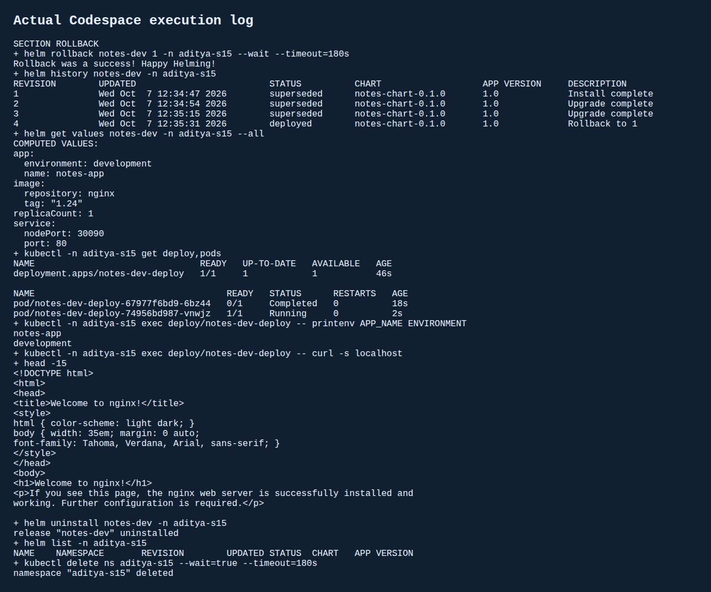
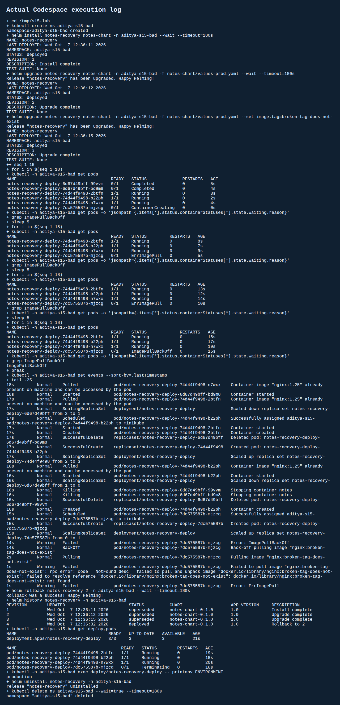

# Session 15 - Helm
Student: Aditya Prasad  
Roll Number: 24BCS10179

## Tasks and implementation
Practised Helm commands, completed install/two upgrades/rollback, and packaged the teacher's Notes mini-project chart. This is a classroom nginx stand-in for Notes, not a full notes backend. Chart files and development/production values are in [notes-chart](notes-chart/). The ConfigMap injects APP_NAME and ENVIRONMENT; Service is NodePort 30090. Tests run in isolated Minikube namespaces inside GitHub Codespaces with Helm v4.3.0.

## Commands actually run
- `helm create practice-chart`: generated a scaffold; lint passed.
- `helm repo add/list/update`, `helm search repo bitnami/nginx --versions`, `helm repo remove`: repository and search practice; no chart purchase/install from the external repository.
- `helm lint notes-chart`, `helm template`: validation and rendered manifests.
- `helm install notes-dev notes-chart --wait`: revision 1, one nginx:1.24 Pod, development environment.
- `helm list`, `helm status`, `helm get values`, `helm get manifest`: inspect deployed release and configuration.
- `helm upgrade ... -f values-prod.yaml --wait`: revision 2, three nginx:1.25 Pods, production.
- Second `helm upgrade` with two replicas, nginx:1.26, staging: revision 3.
- `helm history`, `helm rollback notes-dev 1 --wait`: new revision 4 restores one replica, nginx:1.24, development. HTTP and env readback verified.
- `helm uninstall` and namespace deletion: removed releases and lab resources.

## Bad-upgrade mini-project
A separate release reproduced production revision 2, then upgraded to `broken-tag-does-not-exist`. New Pod reported ErrImagePull then ImagePullBackOff; registry NotFound and events recorded. Old healthy replicas remained available while rollout failed. Rolled back to revision 2: revision 4 was deployed, three replicas Ready, production env verified. Rollback creates a new revision rather than erasing history.

An initial concurrent recovery test failed because NodePort 30090 was already allocated by the first release. Its failed install was removed and the recovery workflow repeated after the first release uninstalled. This was a port collision, not a broken chart. No successful output is invented for that first attempt.

## Evidence
[Commands and install/upgrade/rollback output](evidence/s15-output.txt)  
[Bad-image failure and successful recovery](evidence/s15-bad.txt)  
[Rendered Kubernetes YAML](evidence/s15-rendered.yaml)

These screenshots are rendered from saved real terminal logs.

## Sources
- Teacher session-15/mini-project and Google Doc Session 15.
- https://helm.sh/docs/helm/helm_rollback/
