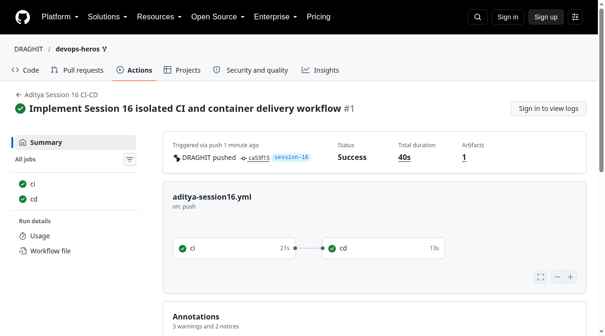

# Session 16 - CI/CD with GitHub Actions
Student: Aditya Prasad  
Roll Number: 24BCS10179

## Project
Calculator application adapted from the teacher's `10-final-cicd-pipeline`. Tests verify addition, subtraction, multiplication, division and divide-by-zero. Dockerfile packages the app; the smoke test prints and checks 15 for 10+5.

## Real execution
[Successful GitHub Actions run](https://github.com/DRAGHIT/devops-heros/actions/runs/37622498065): both CI and CD passed, one artifact uploaded. [Full Actions log](evidence/actions-log.txt). Also executed independently in GitHub Codespaces: five tests passed, build output created, Docker image built, deployed container smoke result 15 checked. [Codespace output](evidence/codespace-log.txt).

## Pipeline
Root `.github/workflows/aditya-session16.yml` is the executable workflow. [workflow.yml](workflow.yml) mirrors it for the submission folder. It triggers on this session branch and this student's paths only.

CI checks out code, sets up Python 3.12, installs pytest, runs unit tests and records JUnit output, builds the application, builds Docker and saves the image as an artifact. CD needs CI success, downloads that artifact on a different runner, loads the built image and deploys a short-lived container with an asserted smoke test. This is real container execution, not a cloud deployment. It does not provision a persistent hosting service.

## Concepts covered
CI integrates build and tests on push; CD delivers/deploys the tested artifact. A workflow contains jobs; jobs contain steps on GitHub-hosted Ubuntu runners. `needs: ci` prevents CD when tests/build fail. Artifacts transfer the same tested image between runners and expire after one day. No user secret is required for this local demo. For an authenticated deployment, secrets belong in GitHub encrypted secrets referenced as `secrets.NAME`, never committed to files. Checkout uses GitHub's short-lived token with contents:read permission only.

## Reproduce
`bash verify.sh` in Codespaces runs tests, build and Docker smoke test. Push app changes on `session-16` to run Actions. No teacher PR is required by the user's updated instruction. Teacher/other students' files were preserved; only student files plus the necessary root workflow were added.

## Sources
- https://docs.github.com/en/actions/concepts/workflows-and-actions/workflows
- Teacher nested final CI/CD demo; formatting compared with teacher PR https://github.com/Nency-Ravaliya/devops-heros/pull/335 without copying its results.
