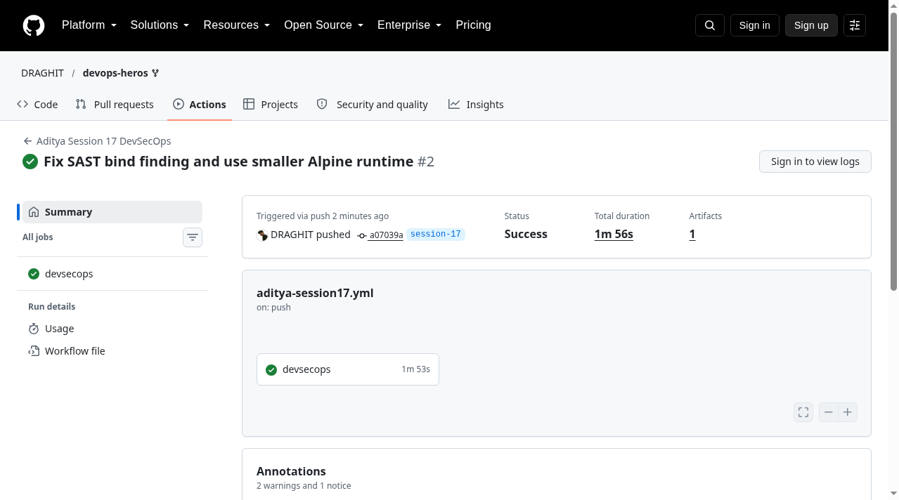
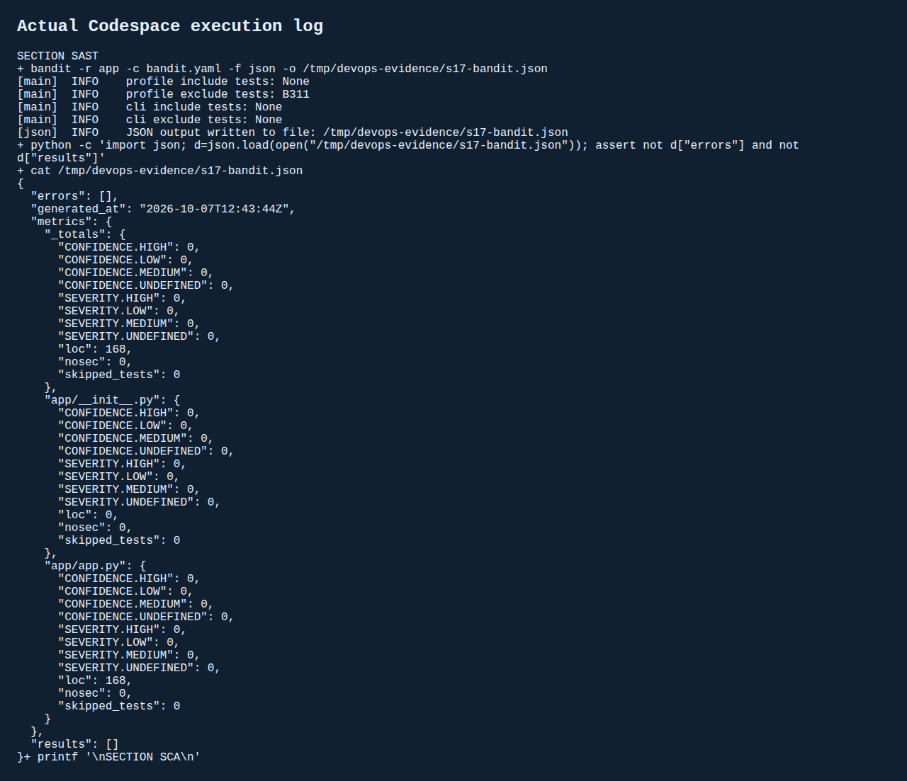
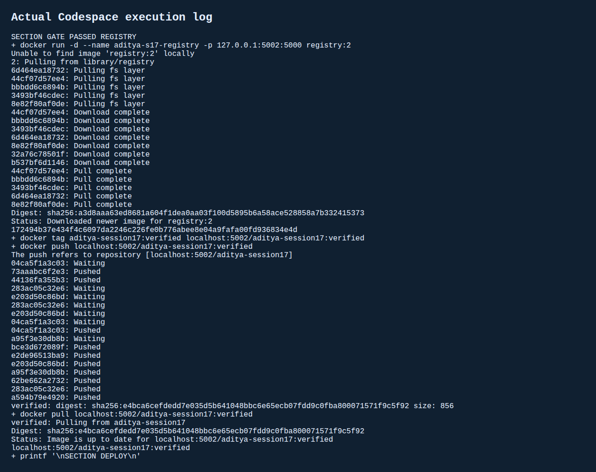
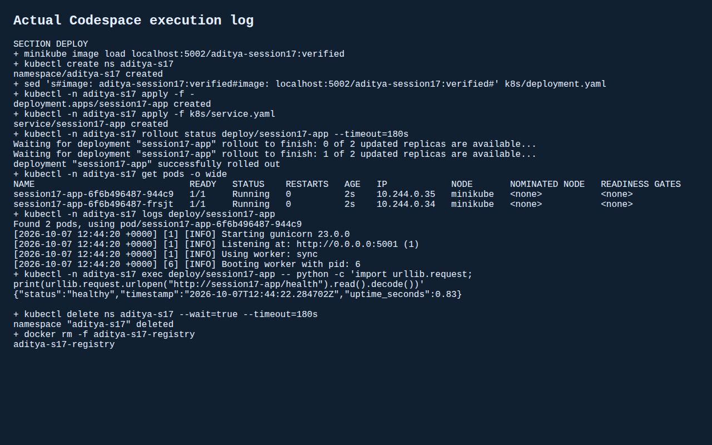

# Session 17 - Complete CI/CD and DevSecOps
Student: Aditya Prasad  
Roll Number: 24BCS10179

## Real result
[Successful actual Actions pipeline](https://github.com/DRAGHIT/devops-heros/actions/runs/37623057685) completed tests, SAST, SCA, secret scanning, Docker build, image scanning/security gate, registry push, kind Kubernetes deployment and health verification. Same sequence also ran in GitHub Codespaces with Minikube: eight tests passed, two Pods Ready, Service /health returned healthy. Namespace and temporary registry were removed.

## Implementation
Adapted teacher Flask dashboard, tests and static assets. The dashboard's /api/pipeline/run is only a UI simulation; it is NOT the evidence of pipeline success. Actual evidence comes from Actions logs and separate terminal execution.

- Unit tests: pytest, eight passed; 69% statement coverage in the successful Codespace run.
- SAST: Bandit with zero findings AND no skipped/error files. B311 only is excluded because random greetings/demo IDs do not serve a security purpose.
- SCA: pip-audit against runtime requirements, no known vulnerabilities at execution time.
- Secrets: Gitleaks scans application and tests, no leaks found. No external registry credentials committed or required.
- Container: non-root gunicorn on Python3.12 Alpine. Trivy gate exits nonzero for HIGH/CRITICAL; final image reported zero in both Alpine OS and Python packages at scan time. This is a point-in-time scan, not a guarantee of no vulnerabilities.
- Registry: actual push and pull against a temporary localhost registry, not Docker Hub or GHCR. Kubernetes loads that pulled image locally using imagePullPolicy Never.
- Deployment: two replicas, readiness HTTP probe, requests/limits, ClusterIP Service. Actual health request passes.

Root `.github/workflows/aditya-session17.yml` executes the pipeline; [workflow.yml](workflow.yml) mirrors it. `set -e` and sequential steps block registry/deployment on a failed gate. No `continue-on-error` hides scanner failure. No paid cloud cluster, external credentials or permanent registry was used.

## Findings fixed, not bypassed
First Actions run failed at Bandit's B104 bind-all-interface finding, skipping downstream jobs. Development-server binding was changed to loopback; the container serves via gunicorn with explicit container binding. Codespace Python3.14 caused Bandit AST errors despite zero exit. Reran under Python3.13 and added an explicit JSON scan-error assertion. Initial Debian image had unfixed OS HIGH/CRITICAL findings, so changed runtime to Alpine and rescanned without vulnerability suppressions or lowering severity gate. See [remediation notes](evidence/remediation-notes.txt).

## Evidence
[Codespace complete command log](evidence/s17-output.txt)  
[Actions log](evidence/actions-log.txt)  
[Bandit JSON](evidence/s17-bandit.json), [SCA JSON](evidence/s17-sca.json), [Trivy JSON](evidence/s17-trivy.json)

Screenshots below render the saved actual terminal output.

## Sources
- Teacher Session17 demo and Google Doc requirements.
- https://aquasecurity.github.io/trivy/latest/docs/configuration/filtering/
- https://github.com/PyCQA/bandit/issues/1326
- https://github.com/PyCQA/bandit/pull/1323
- Formatting reference only: https://github.com/Nency-Ravaliya/devops-heros/pull/336
