# Session 10 - Pods, ReplicaSets and Deployments

Student: Aditya Prasad  
Roll Number: 24BCS10179

## Task 1: deployment strategies

Executed the four strategy labs in the disposable aditya-s10 namespace on Minikube. YAML files are included in their corresponding folders, based on the teacher examples read for this assignment. Actual results are in [strategy output](evidence/s10-strategies.txt).

- RollingUpdate: four v1 Pods replaced by four v2 Pods; old ReplicaSet reached zero and new ReplicaSet four. Readiness/maxSurge settings help availability but do not prove zero downtime by themselves.
- Blue-green: both versions deployed; Service selector switched from blue to green. Immediate first request still returned blue while endpoints reconciled. A later [verification request](evidence/s10-green-confirmed.txt) returned GREEN ENVIRONMENT. No instantaneous-switch claim.
- Canary: nine stable Pods and one canary Pod shared the Service. Thirty sampled requests observed both versions (29 stable, one canary). Replica ratios approximate a traffic split; this sample is not proof of exactly 10 percent per request.
- Recreate: events show old ReplicaSet scaled 3 to 0 before new ReplicaSet scaled 0 to 3. All three v2 replicas became available.

## Task 2: Pod lifecycle

Applied all twelve YAML files, checked each Pod with get and describe, and captured real outputs/screenshots. Pod phase and display STATUS differ: CrashLoopBackOff/ImagePullBackOff are container waiting/display reasons, not official Pod phases.

### lifecycle-running

Running and Ready; container pulled and started.

[Full actual output](evidence/pod-lifecycle/lifecycle-running.txt)

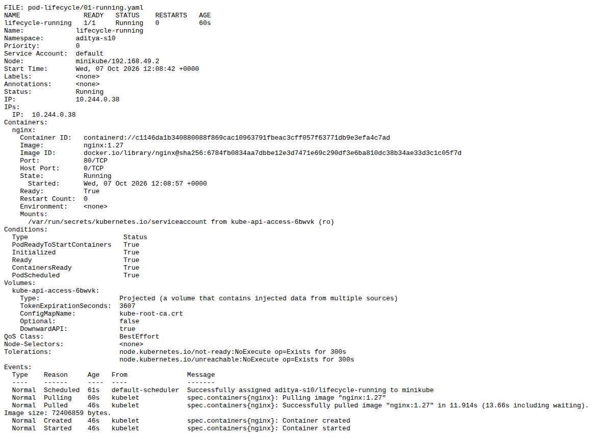

### lifecycle-pending

Pending with FailedScheduling: requested 9Gi, unavailable memory/CPU.

[Full actual output](evidence/pod-lifecycle/lifecycle-pending.txt)

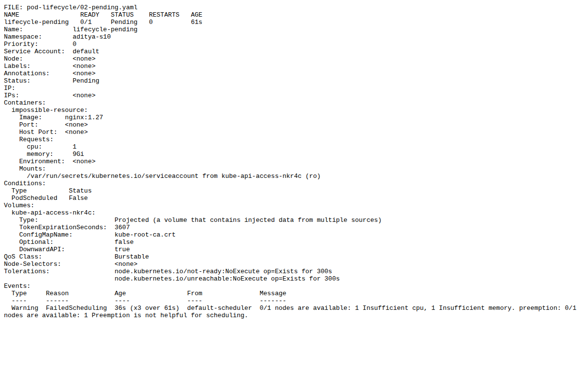

### lifecycle-succeeded

Succeeded/Completed, exit 0; no restart.

[Full actual output](evidence/pod-lifecycle/lifecycle-succeeded.txt)

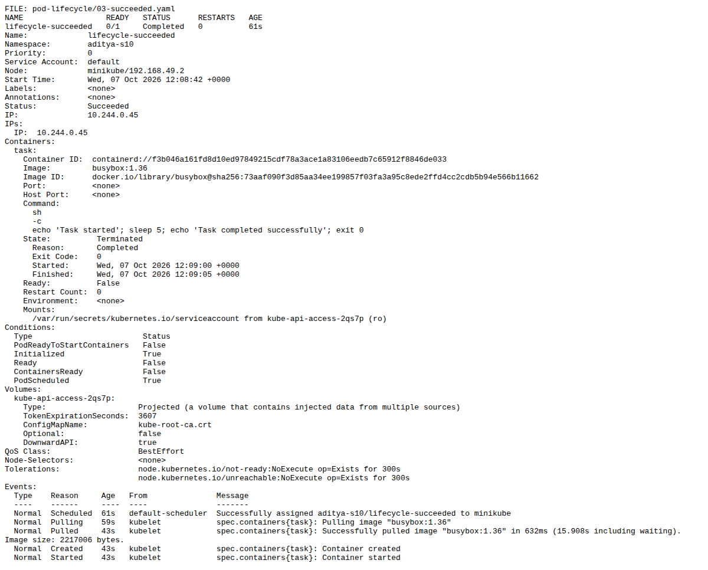

### lifecycle-failed

Failed/Error, exit 1; restartPolicy Never.

[Full actual output](evidence/pod-lifecycle/lifecycle-failed.txt)

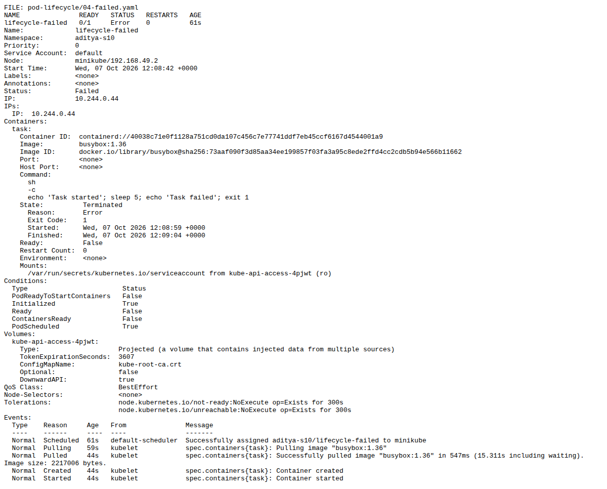

### lifecycle-crashloop

Repeated exit 1 with three restarts and BackOff events. Snapshot caught Error between restarts.

[Full actual output](evidence/pod-lifecycle/lifecycle-crashloop.txt)

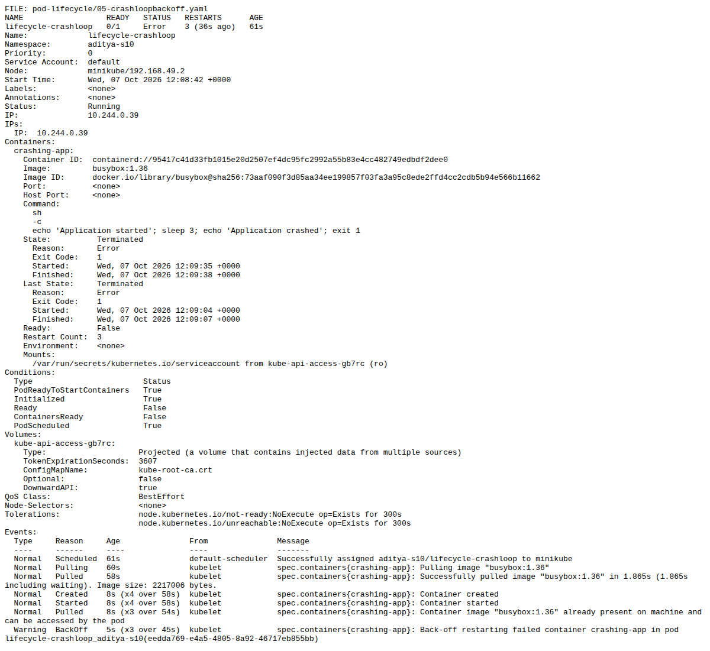

### lifecycle-image-error

ImagePullBackOff/ErrImagePull for nonexistent image.

[Full actual output](evidence/pod-lifecycle/lifecycle-image-error.txt)

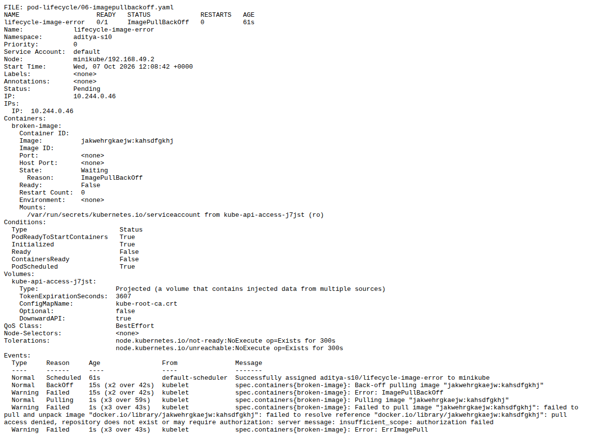

### lifecycle-readiness

Ready true after the HTTP readiness probe passed.

[Full actual output](evidence/pod-lifecycle/lifecycle-readiness.txt)

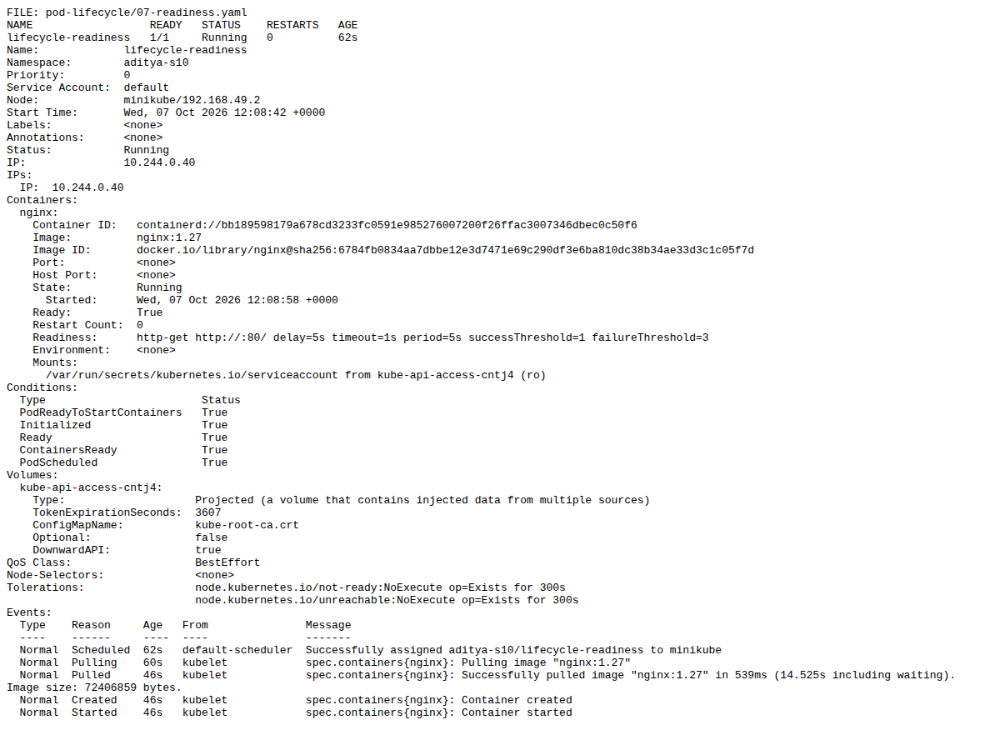

### lifecycle-liveness

Probe failure and Killing events observed after health file removal. Snapshot predates restarted-container count increment.

[Full actual output](evidence/pod-lifecycle/lifecycle-liveness.txt)

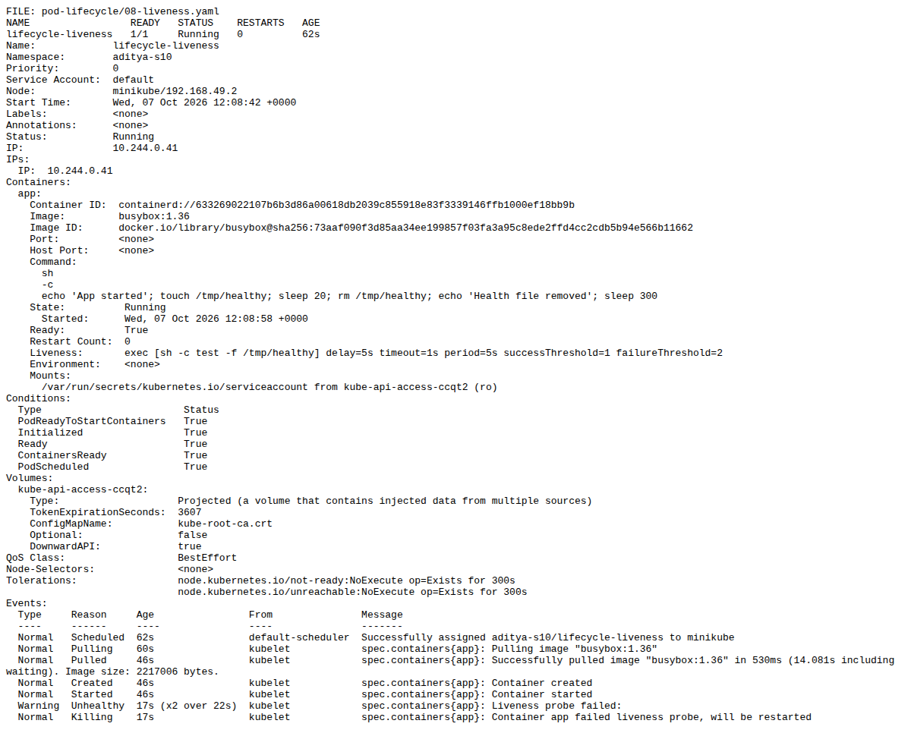

### lifecycle-startup

Initially not ready; startup failures during deliberate delay, then Ready true.

[Full actual output](evidence/pod-lifecycle/lifecycle-startup.txt)

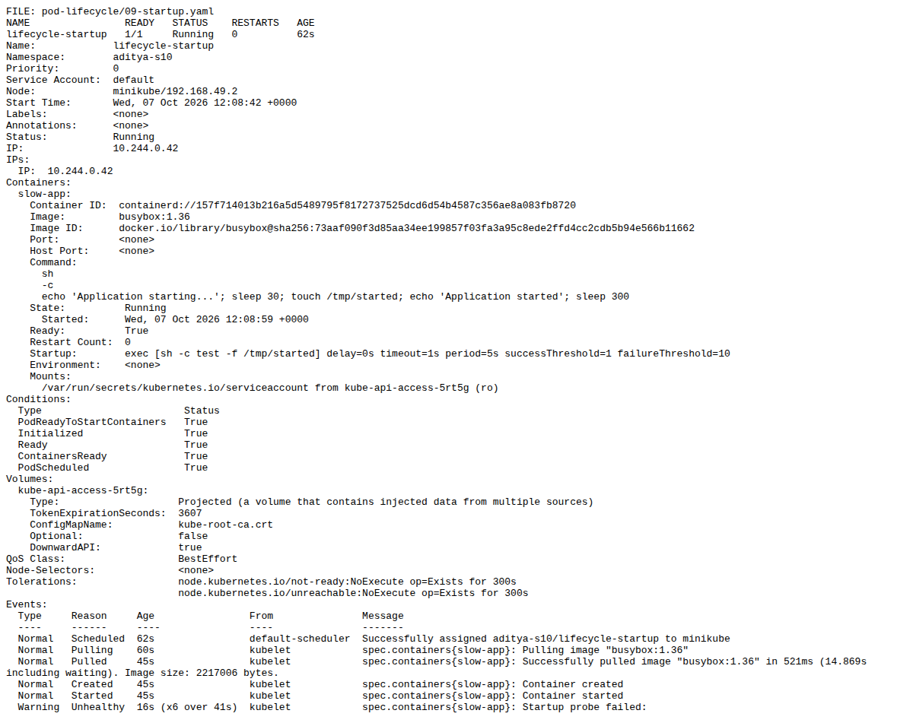

### lifecycle-init

Setup container completed before application started.

[Full actual output](evidence/pod-lifecycle/lifecycle-init.txt)

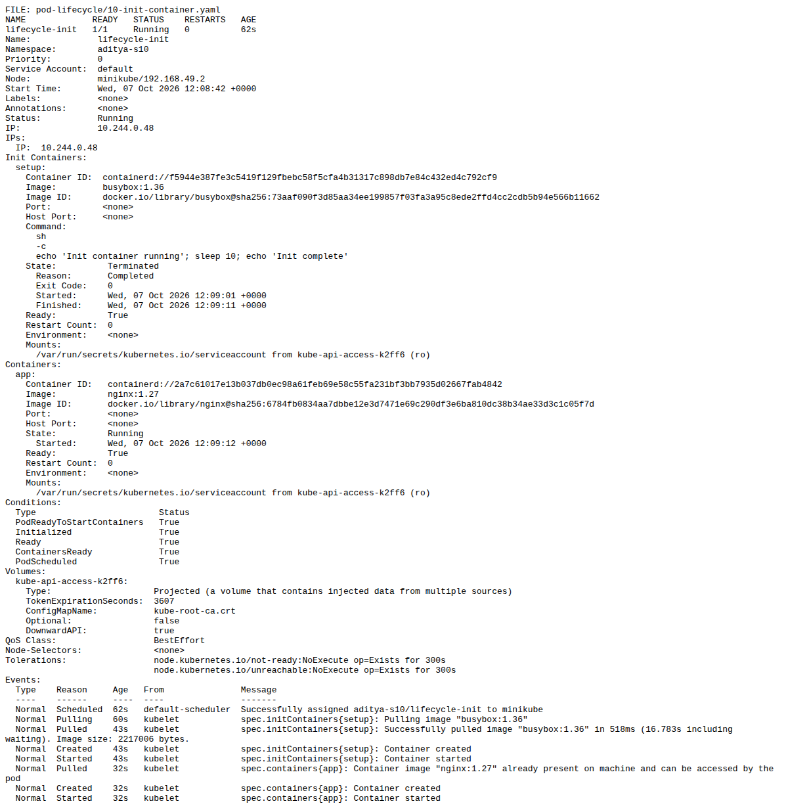

### lifecycle-multi-container

Both app and sidecar Ready, 2/2.

[Full actual output](evidence/pod-lifecycle/lifecycle-multi-container.txt)

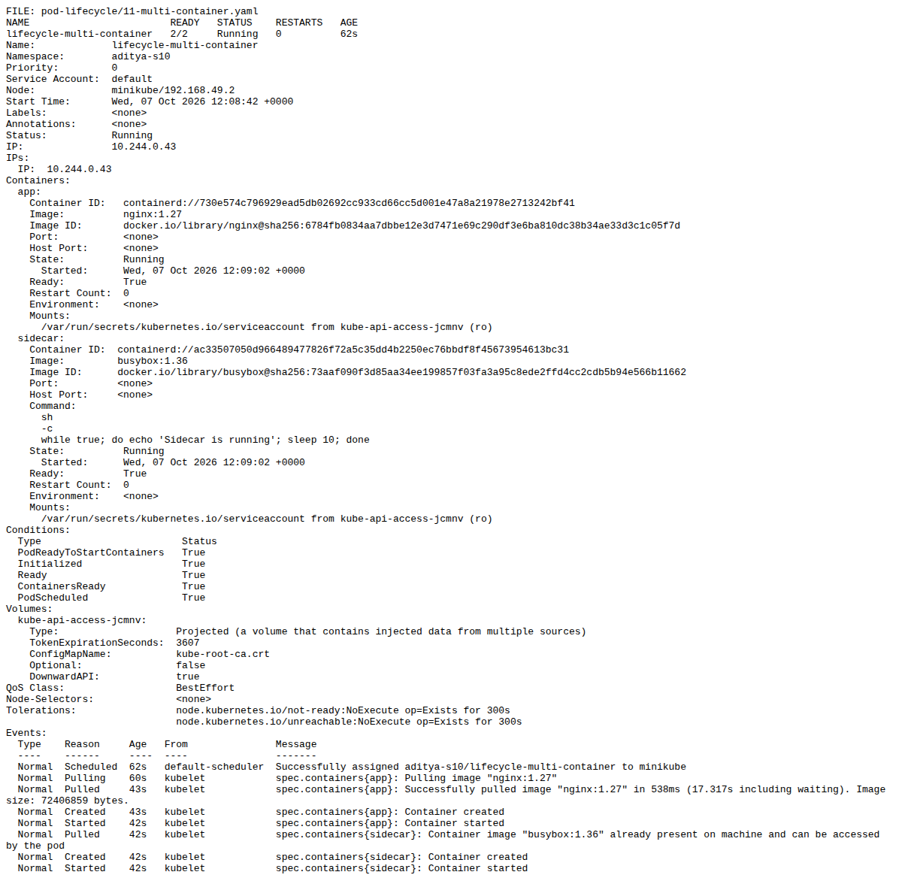

### lifecycle-termination

Running, then delete requested, Terminating captured and deletion wait completed.

[Full actual output](evidence/pod-lifecycle/lifecycle-termination.txt)

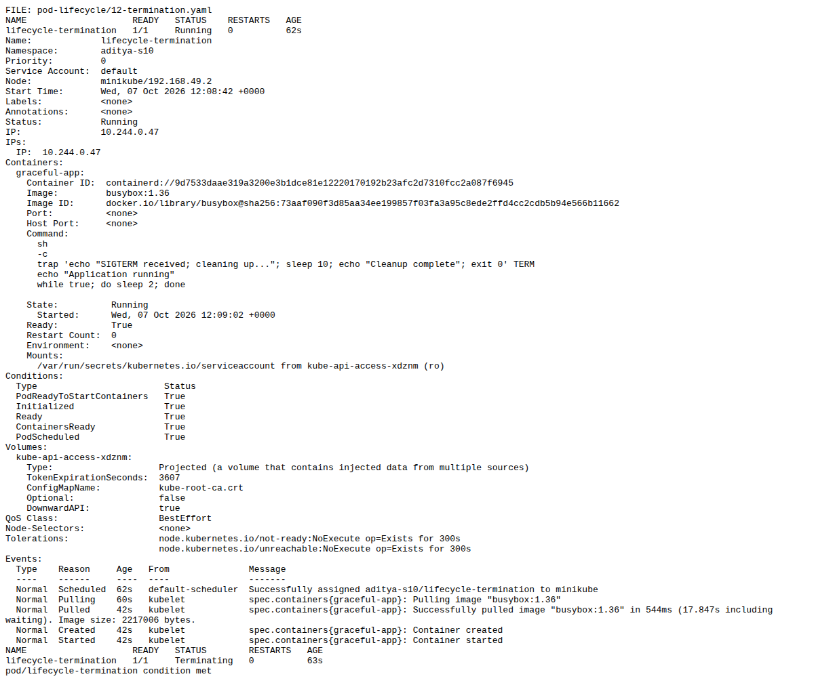

## Commands and cleanup

The included s10-strategies.sh and lifecycle scripts record the actual sequence: kubectl apply, rollout status, get, describe, exec, delete and wait. The first lifecycle assertion ran before the completion Pods had finished; those snapshots were rechecked after they reached their true states. Captured evidence reflects the later checks. All student lab resources were deleted by removing only aditya-s10.

## Sources

[Assignment document](https://docs.google.com/document/d/1cjXFYf2Thm8cBEN-0C48B-v02cj3jGLd47lcO18prHE/edit?tab=t.0), Session 10. Teacher session10-k8s-core-objects strategy and pod-lifecycle files inspected. No student's output copied.
