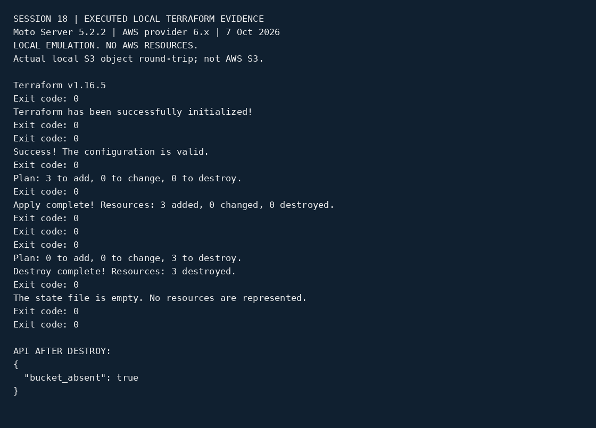

# Session 18 - Terraform local AWS API emulation

Student: Aditya Prasad | Roll: 24BCS10179

## Current status

Real Terraform commands executed against **Moto Server 5.2.2 on localhost**, not Terraform's mock provider: init, fmt, validate, plan, apply, show, output, destroy. **Local AWS API emulation only. No AWS account used and no AWS resources created.** The assignment's literal live-AWS requirement remains unfulfilled.

## Executed evidence

- [Actual Terraform command transcript](terraform-s3-demo/local-emulation/evidence/terraform-output.txt)
- [API readback after apply](terraform-s3-demo/local-emulation/evidence/api-after-apply.json)
- [API readback after destroy](terraform-s3-demo/local-emulation/evidence/api-after-destroy.json)

Terraform applied and destroyed three resources. The S3-compatible endpoint stored and returned a small object; bytes matched, then the object was deleted before destroy. API readback confirmed bucket deletion.

## Safe local configuration

The original AWS configuration and research folders are preserved. Separate `local-emulation/` uses fixed localhost endpoints for EC2/S3/STS/IAM/KMS and dummy `testing` credentials. Never point it at AWS. Local state and saved plans are ignored, not committed.

## What remains

Live AWS provisioning, AWS-console screenshots and AWS-specific security/network/runtime checks are not performed. A teacher must decide whether a local substitute is acceptable.

## Earlier preparation

# Session 18 - Terraform and AWS Services
Student: Aditya Prasad  
Roll Number: 24BCS10179

## Original validation status: partial, no AWS resources provisioned
Implemented [terraform-s3-demo](terraform-s3-demo/) and official-source AWS research. Codespaces ran Terraform1.16.5 init, fmt, validate and a mock AWS provider plan test: one passed, zero failed, three proposed resources. See [actual verification output](evidence/s18-output.txt). Live AWS lifecycle is blocked on chosen account/region and cost approval. Mock validation is not a live deployment.

## AWS service research
- [IAM](aws-services/01-iam/README.md)
- [EC2](aws-services/02-ec2/README.md)
- [S3](aws-services/03-s3/README.md)
- [VPC](aws-services/04-vpc/README.md)
- [DynamoDB and RDS](aws-services/05-dynamodb-rds/README.md)

Sources are linked in each README. No credentials, state or paid resources are included.
