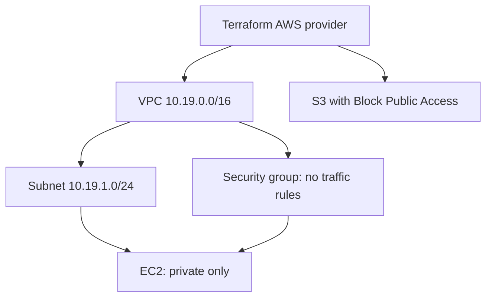

# Session 19 - Cloud and Terraform in Action
Student: Aditya Prasad  
Roll Number: 24BCS10179

## Status: partial, live AWS blocked
Terraform project implements AWS provider, variables, VPC/subnet/security-group/EC2/S3 resources, implicit dependencies and outputs. The instance is intentionally isolated: no public IP, internet gateway, NAT or ingress/egress rules. No web accessibility is claimed. IMDSv2 and encrypted root volume configured. Example region/type/name/AMI are not approved deployment parameters.

## Architecture

## State and commands
`terraform init -backend=false`, fmt, validate and test run locally in Codespaces. Mock provider test plans resources without AWS API calls. State records resource bindings and can hold sensitive values; state and plan files are excluded from git. Committing provider lock file fixes selected provider versions.

Live `plan`, `apply`, `show`, `output`, `destroy` have NOT run against AWS. The safe workflow is authenticate with temporary credentials, choose a valid regional AMI/account/region and review costs, inspect a saved plan, obtain approval, apply the reviewed plan, verify actual outputs/resources, and obtain scope for cleanup then destroy. Destroy can remove data; do not confuse stopping EC2 with destroying billable storage. This does not complete the assignment's real AWS resource/screenshot requirement.

## Evidence
[Actual mock verification output](evidence/s19-output.txt): init, fmt, validate and mock plan test passed, six resources proposed. No fake AWS resource IDs or screenshots.

## Sources
- Teacher session19-cloud-terraform and Google Doc Session19 requirements.
- https://developer.hashicorp.com/terraform/language/tests/mocking
- https://docs.aws.amazon.com/vpc/latest/userguide/how-it-works.html
- https://docs.aws.amazon.com/AWSEC2/latest/UserGuide/concepts.html
