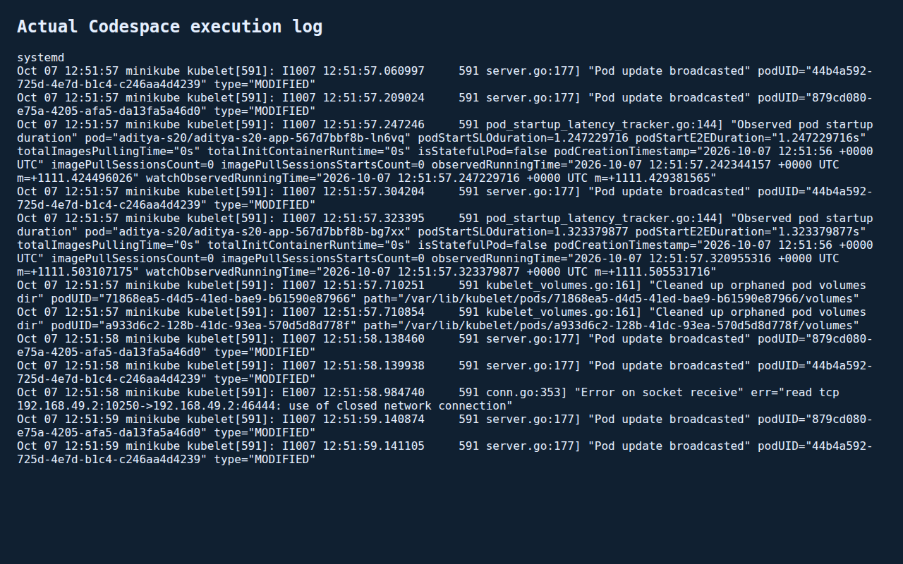

# Session 2 - Linux Fundamentals

Student: Aditya Prasad  
Roll Number: 24BCS10179

## Required tasks

The assignment asks for soft/hard-link practice, adduser versus useradd and creation of a test user, journalctl/service-log practice, and Linux command cheat-sheet practice.

## Implementation and verification

Run the included exercise:

```bash
bash verify-linux.sh
```

It uses a temporary directory and removes its files when finished.

### Task 1: Soft links and hard links

Executed `ln -s original.txt soft.txt` and `ln original.txt hard.txt`. `ls -li` and `stat` verified the original and hard link shared one inode. After deleting the original, the hard link retained the text `Linux link exercise`; the soft link remained a dangling link. Deleted both links afterward. The script checks these conditions with shell assertions.

For an interview: a hard link names the same inode and cannot normally cross filesystems or link directories. A symbolic link stores a target path, can cross filesystems, and becomes dangling if that target is removed. These distinctions answer the assignment's interview question.

### Task 2: adduser versus useradd

On this Ubuntu system, `adduser --help` confirms the high-level user-creation interface, including home-directory and disabled-login options. `useradd` is the lower-level utility; `adduser` is convenient for interactive Ubuntu account creation because it applies distribution defaults and prompts for account details.

**Initial run limitation, resolved below:** a real test user could not be created. `sudo -n true` returned `sudo: a password is required`. No account was created and no privilege escalation was attempted.

Remaining commands on a disposable Ubuntu VM with admin access:

```bash
sudo adduser --disabled-password --gecos '' devops-test
id devops-test
getent passwd devops-test
sudo deluser --remove-home devops-test
```

Capture the real output before considering this task verified.

### Task 3: journalctl

Executed:

```bash
journalctl -u cron.service -n 5 --no-pager
```

The actual result was a warning that this user cannot see messages from other users/system, followed by `-- No entries --`. This verifies command execution, not successful inspection of service logs. `journalctl` queries the systemd journal; `-u` filters by unit, `-b` selects a boot, `-f` follows new messages, and `--since` filters by time.

**Resolved in the later node-runtime check below.** Do not assume cron is installed merely from an empty query.

### Task 4: Cheat-sheet practice

Executed safe file operations: `pwd`, `mkdir`, `touch`, `cp`, `mv`, `grep`, `wc`, `chmod`, `stat`, `find`, and `rm`. The script verifies the expected file contents and `600` permissions.

The repository's `Linux Networking Cheat Sheet.pdf` covers the `ip` utility. Executed `ip -br addr`, `ip -br link`, `ip route`, `ip maddr`, `ip neigh`, and `ip -s link`. These inspect addresses, interfaces, routes, multicast memberships, neighbors and traffic counters. All returned output. Address/interface/route modification examples were not executed on this shared machine because changing its live network could interrupt access.

## Captured terminal evidence

[session2-terminal-output.txt](session2-terminal-output.txt) records the actual link/file assertions, sudo limitation and journal query. It excludes machine network addresses and unrelated system logs. The screenshot from another student is not reused. Output is submitted as text, as allowed by the assignment.

## Status

Verified within the documented classroom runtime. Link exercises, safe command practice, real test-user creation and cleanup pass. System and service journal entries were read from the systemd-enabled Minikube node inside the requested Codespace. The Codespace outer container itself still has no systemd journal.

## Sources and format

- [Assignment document](https://docs.google.com/document/d/1cjXFYf2Thm8cBEN-0C48B-v02cj3jGLd47lcO18prHE/edit?tab=t.0)
- Teacher Session 2 resources in this repository.
- [Student folder placement reference, PR 310](https://github.com/Nency-Ravaliya/devops-heros/pull/310). Used only for placement; its combined Session 1/2 submission was not copied.
- [PR 127 formatting reference](https://github.com/Nency-Ravaliya/devops-heros/pull/127): task-numbered headings and terminal-evidence attachment. Its command outputs are not used as our evidence.

## Codespace recheck

The original sandbox limitation was retested in the requested Codespace. sudo succeeded; adduser created aditya-devops-test with home directory and bash shell, id/getent confirmed it, and deluser --remove-home cleaned it up. [Actual admin output](codespace-admin-output.txt). Task 2 is now verified.

PID 1 is docker-init, not systemd. Even sudo journalctl found no journal files; a logger test also produced no journal entries. This remains true for the outer Codespace container; the separate node-runtime check below resolves the task without pretending that the container itself runs systemd. Earlier network-changing examples were not required to be destructive host changes.

## Systemd node-runtime journal check
The Minikube node container has systemd as PID1, unlike the outer Codespace docker-init process. Executed `minikube ssh -- "ps -p 1 -o comm=; sudo journalctl -u kubelet -n 12 --no-pager"` and an unrestricted last-eight-entry system query. Actual timestamped kubelet entries show Pod update broadcasts, container startup latency and volume cleanup. One error records a closed network connection; this is an observed log entry, not proof the service failed. `-u kubelet` selects that installed service; `-n` limits the number; `--no-pager` makes evidence capture noninteractive.

[Service journal and PID1 output](s2-systemd.txt), [system journal output](s2-system-journal.txt). No cron entry is claimed. Screenshot renders this actual saved terminal log.


