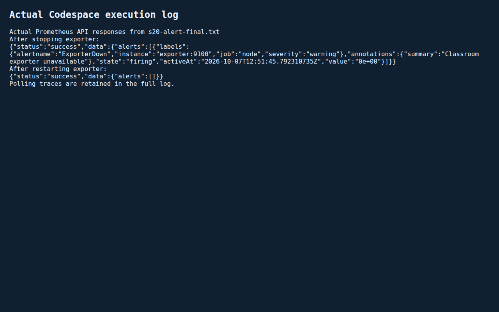
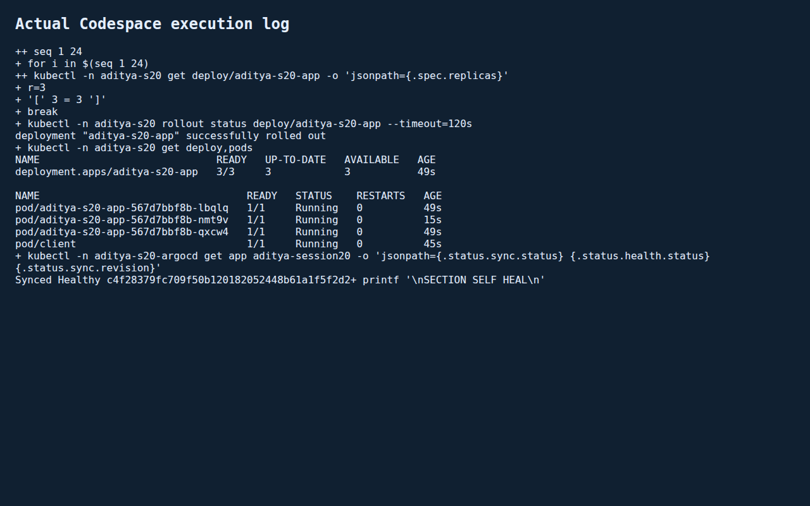
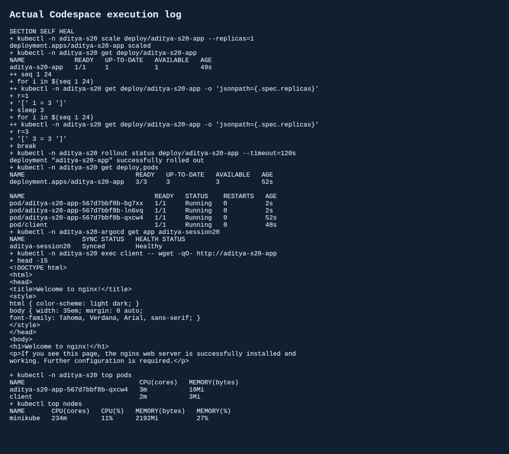

# Session 20 - Monitoring, Observability and GitOps
Student: Aditya Prasad  
Roll Number: 24BCS10179

## Tasks
Actual Prometheus metric/log/alert demo, documentation of metrics/logs/traces, and Argo CD GitOps mini-project in the requested GitHub Codespace. No paid cloud service used.

## Monitoring
Prometheus3.15.0 scrapes itself and a node-exporter every5 seconds. Actual CPU utilization query returned81.60%; available-memory-derived usage33.00% at the saved sample. These are runtime-visible Linux measurements, not a user-device reading. Exporter-down rule requires up==0 for5 seconds. Actual ExporterDown alert reached firing after stopping exporter; after restart it resolved (alerts empty). Initial fixed-delay snapshot only reached pending, so a bounded condition check was used and that earlier snapshot preserved. Kubernetes top and logs plus HTTP checks cover workload health. No external notification delivery is claimed.

Initial exporter scrape failed due host bridge-forwarding policy; only the lab bridge's intra-network forwarding was opened, no global firewall changes. Original failures retained.

## Observability
See [metrics, logs, traces, common tools and Kubernetes notes](observability.md). Tracing is documented, not presented as an installed tracing backend.

## GitOps
Argo CD3.5.4 watches only this student's app directory on session-20 in the fork, using automatic prune and selfHeal. Application object stays outside its source directory to avoid recursive ownership. Workload is nginx Deployment with two replicas, readiness probe, resource requests/limits and ClusterIP Service. Actual initial sync deployed two replicas. Commit c4f2837 changed Git desired state to three; Argo synced that revision and reached3/3. Cluster-only scale down to one was then self-healed to three within the sampled3-second interval; Synced/Healthy, nginx Service HTTP and CPU/memory metrics verified.

Install needed server-side apply for a CRD exceeding client annotation-size limits, and namespace-adjusted RoleBinding subjects. Controller's original forbidden node-list error was fixed and cluster sync rechecked. No fabricated Synced claim is made from a mere healthy field.

## Evidence
[Original monitoring attempt](evidence/s20-monitor.txt), [metric-network fix](evidence/s20-fix.txt), [actual firing and recovery polling](evidence/s20-alert-final.txt), [initial Git sync/HTTP/logs](evidence/s20-gitops.txt), [Git change and self-heal](evidence/s20-gitops-final.txt).

These screenshots render saved real execution/API responses.

## Sources
- https://prometheus.io/docs/introduction/overview/
- https://argo-cd.readthedocs.io/en/stable/user-guide/auto_sync/
- https://opentelemetry.io/docs/concepts/signals/traces/
- Teacher Session20 mini-project and Google Doc requirements.
