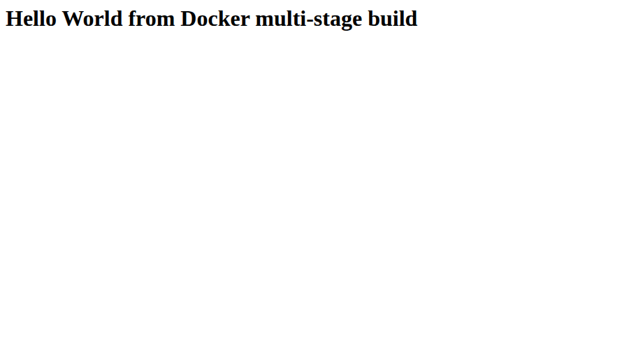

# Session 7 - Docker Multi-Stage Build

Student: Aditya Prasad  
Roll Number: 24BCS10179

## Required tasks

Build/run a multi-stage image, verify the exact Hello World message and a container on port 8080 using `docker ps`, and deploy at least Node.js, Python and Java applications with Docker.

## Implementation

The teacher repository was cloned and its `multi-stage-dockerfile` read. That example uses port 3000, whereas the Doc requires 8080. The student version listens on 8080 and returns `Hello World from Docker multi-stage build`. Its verification stage checks JavaScript syntax; the production stage copies only the server and uses the non-root node user. Node.js/Python/Java apps and Dockerfiles are included in independent folders on this branch.

## Actual Codespaces verification

The multi-stage image built successfully. Its running container returned the exact message at localhost:8080; [docker ps output](evidence/s7-docker-ps.txt) confirms port 8080 mapping. The actual browser page was captured and visually inspected:



Node.js, Python and Java images identical to the included source files were built and run in the same Codespace, with successful HTTP checks. [Three-application runtime evidence](evidence/s6-docker-ps.txt) includes these containers alongside the Session 6 servers. Exercise containers were removed after verification.

## Commands executed

On a Docker-enabled machine from this folder:

```bash
docker build -t aditya-session7 multi-stage-dockerfile
docker run -d --name aditya-session7 -p 8080:8080 aditya-session7
curl --fail http://localhost:8080
docker ps --filter name=aditya-session7
for app in nodejs-app python-app java-app; do
  docker build -t "aditya-s7-$app" "$app"
done
docker run -d --name aditya-s7-node -p 13000:3000 aditya-s7-nodejs-app
docker run -d --name aditya-s7-python -p 18000:8000 aditya-s7-python-app
docker run -d --name aditya-s7-java -p 18880:8080 aditya-s7-java-app
```

The application response and container output are attached above. Test containers were removed afterward.

## Sources

[Assignment document](https://docs.google.com/document/d/1cjXFYf2Thm8cBEN-0C48B-v02cj3jGLd47lcO18prHE/edit?tab=t.0), Docker Multi-Stage Build Homework; teacher session6-7-docker/multi-stage-dockerfile inspected for implementation context.
