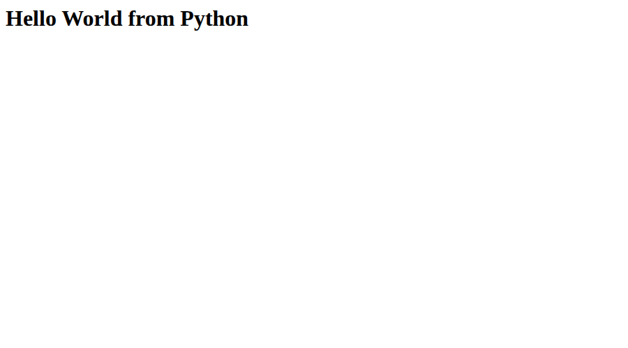
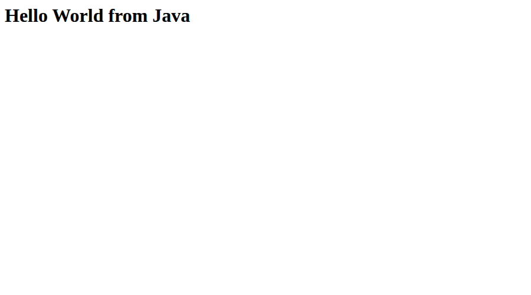
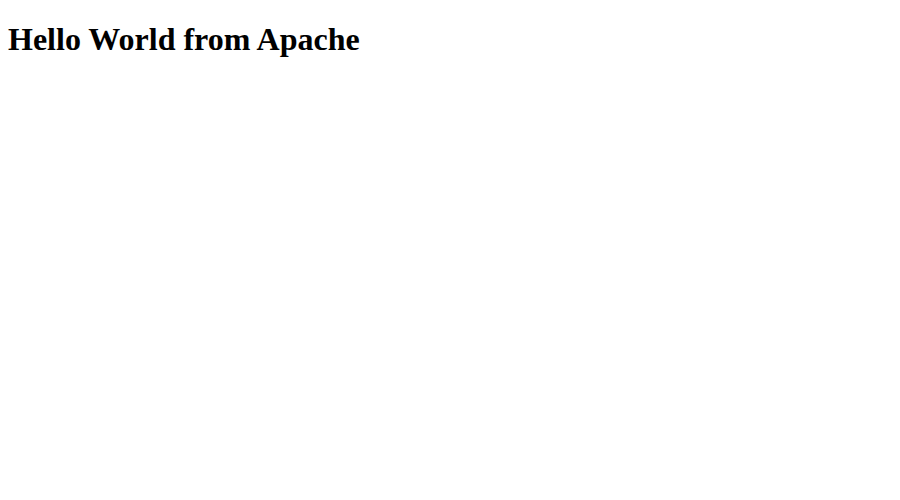
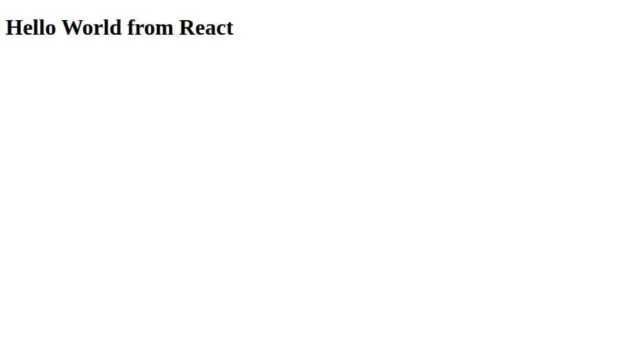
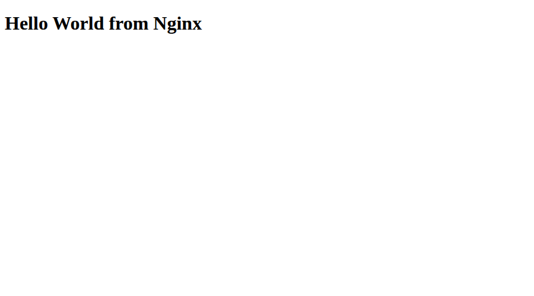

# Session 6 - Docker Hello World Applications

Student: Aditya Prasad  
Roll Number: 24BCS10179

## Required tasks and implementation

The Google Doc requires six separate Hello World web applications with code and Dockerfiles: `nodejs-app`, `python-app`, `java-app`, `Apache-app`, `React-app`, and `nginx-app`. All six folders are included. Node/Python/Java run simple HTTP servers; Apache and Nginx serve HTML; React is bundled with esbuild and served by Nginx in its image. Dependencies are locked for `npm ci`.

## Actual verification

[verification.txt](verification.txt) records local tests. Node and Python returned the correct Hello World HTTP body. Java initially failed because port 8080 was in use; a configurable `PORT` fixed the conflict and port 18880 returned the correct Java response. React's initial Vite build exhausted memory. Replaced the build tool with esbuild, then installed and bundled successfully. No failure output is presented as success.

## Codespaces container verification update

All six images were built with Docker in the student Codespace. Each container ran with its documented port and returned the intended Hello World page. React was also rendered in Chromium, not merely checked as a bundle. The six real browser screenshots below were captured and visually inspected. [docker-ps.txt](evidence/docker-ps.txt) is the actual running-container output. The exercise containers were removed after testing. Earlier local-only verification limits are now resolved.












## Commands executed in Codespaces

Run on a Docker-enabled machine, from this student folder:

```bash
for app in nodejs-app python-app java-app Apache-app React-app nginx-app; do
  docker build -t "session6-${app,,}" "$app"
done
docker run --rm -d --name s6-node -p 13000:3000 session6-nodejs-app
docker run --rm -d --name s6-python -p 18000:8000 session6-python-app
docker run --rm -d --name s6-java -p 18880:8080 session6-java-app
docker run --rm -d --name s6-apache -p 18081:80 session6-apache-app
docker run --rm -d --name s6-react -p 18082:80 session6-react-app
docker run --rm -d --name s6-nginx -p 18083:80 session6-nginx-app
docker ps
```

Open the six localhost ports in a browser and capture the real pages. Remove only these exercise containers afterward. Status: six container applications built, run and browser-verified.

## Source

[Assignment document](https://docs.google.com/document/d/1cjXFYf2Thm8cBEN-0C48B-v02cj3jGLd47lcO18prHE/edit?tab=t.0), Docker Homework Tasks. Teacher session6-7-docker examples inspected; other students' outputs not copied.
