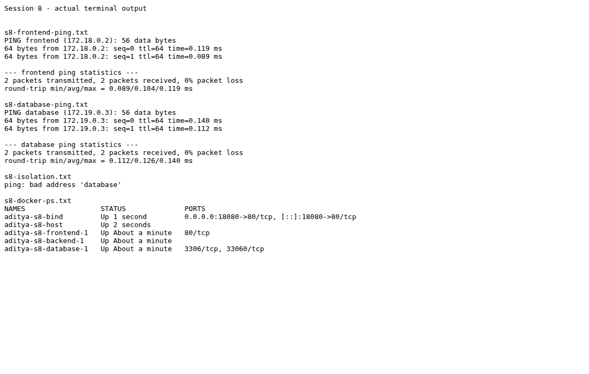

# Session 8 - Docker Networking and Volumes

Student: Aditya Prasad  
Roll Number: 24BCS10179

## Task 1: three containers and networks

`compose.yaml` prepares Nginx frontend, Alpine backend and MySQL database. Backend joins frontend and database networks. A third isolated network is declared. MySQL generates its initial root password at runtime; no credential is committed. Compose may not create an unused network, so the lab below explicitly creates the third one.

```bash
docker compose up -d
docker network create aditya-s8-isolated
docker compose exec backend ping -c 2 frontend
docker compose exec backend ping -c 2 database
docker compose exec frontend ping -c 2 database
```

The final probe tests isolation and is expected not to resolve/reach the database. Expected behavior is not recorded as actual output.

## Task 2: Apache host network

On a Linux Docker host with port 80 free:

```bash
docker pull httpd:2.4-alpine
docker run -d --name aditya-s8-apache --network host httpd:2.4-alpine
curl --fail http://localhost:80
```

Host networking shares the host network stack. No port publishing flag is needed; do not run this where it would collide with an existing server.

## Task 3: bind mount

`site/index.html` contains Hello students.

```bash
docker run -d --name aditya-s8-bind -p 18080:80 --mount "type=bind,src=$(pwd)/site,dst=/usr/share/nginx/html,readonly" nginx:stable-alpine
curl --fail http://localhost:18080
printf '<h1>Hello students - updated</h1>\n' > site/index.html
curl --fail http://localhost:18080
```

The second response must contain the changed text without restarting the container. The read-only flag prevents container writes; host edits still change the mounted content.

## Task 4: overlay research

Docker's overlay driver connects containers across hosts using a distributed network. Swarm initializes/manages the hosts participating in the network. It is useful for multi-host services; an attachable overlay permits standalone containers to join as well. Docker documents required host-to-host ports and optional encrypted data-plane traffic. An ordinary bridge network is local to one host, not a substitute for multi-host overlay verification.

## Actual Codespaces verification

All three exercise containers ran. Backend-to-frontend and backend-to-database pings each returned two replies, zero packet loss. Frontend could not resolve the database on the separate network, confirming isolation. The initial probes failed despite correct DNS and attachments: the host had legacy FORWARD DROP rules alongside Docker's nft rules. Scoped temporary ACCEPT rules on the two lab bridges fixed same-network traffic. Those rules were removed with the exercise afterward, rather than disabling the host firewall globally.

Apache with host networking returned its page on localhost:80. Nginx bind mount returned Hello students, then Hello students - updated after editing the host file without restarting. Actual responses and docker ps output are in [evidence/](evidence/). All exercise containers/networks were removed; site/index.html was restored.



Overlay is a research task, not an asserted multi-host deployment. The actual commands/output above cover Tasks 1-3; no fictional overlay cluster is claimed.

## Sources

- [Assignment document](https://docs.google.com/document/d/1cjXFYf2Thm8cBEN-0C48B-v02cj3jGLd47lcO18prHE/edit?tab=t.0)
- [Docker overlay driver](https://docs.docker.com/engine/network/drivers/overlay/)
- Teacher session8-docker-networking-volume files inspected for context.
